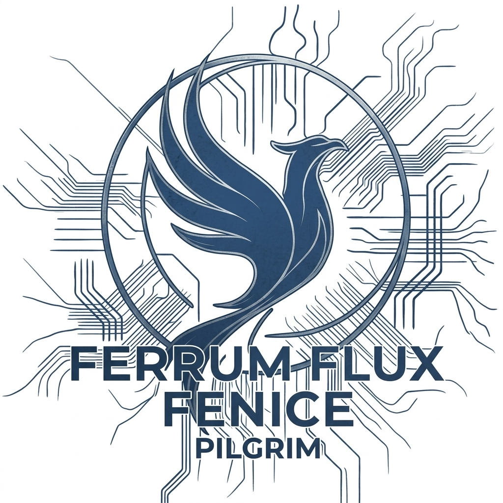

  

  # Hi, I'm Erin

  **BUILDER · WRITER · AI INFRASTRUCTURE**

  
  

  
  
  
  
  
  
  
  
  
  

---

I am not here to be a vibe-coder or introduce AI slop into the community.
In fact my goal and intent is to do the exact opposite. Each comment,
PR, or issue is tested, validated, researched thoroughly, determined
for viability and capability fully before a line of code is written. 
My goal is to find where the bugs connect. How the 3 issues that are
separate actually inter-weave. I won't get it perfect. Mistakes will
happen. I keep showing up, keep learning, keep contributing.

I run a seven-device home lab connected over Tailscale: three Android
phones (a Samsung Galaxy S26 Ultra and a Google Pixel 10 Pro on Android
17 Beta paired for cross-vendor testing on every Android change, plus
a Samsung Galaxy S7 on Android 8 / API 26 for old-Android compatibility
checks), a Windows desktop with an RTX 5070 for inference and Docker
builds, a Windows laptop for mobile work, an Ubuntu VPS for persistent
services, and a Chromebook running Debian inside Crostini.

I run a Claude Code setup with specialist agent roles for different
concerns: one plans, one writes code, one documents, one keeps the repo
clean, one researches, one handles audience-facing work. Session hooks
enforce safety rules before any git commit or push. Every non-trivial
call gets written down, both wins and bail decisions, so I can check my
own reasoning and anyone reading along can follow how I got there. I am
a learn first, plan it out, deep dive, problem solver. AI-assisted,
fully disclosed, choices and on-device verification mine. Currently
studying the Android ecosystem, network and system security, Python,
Linux, and the AI/LLM landscape.

---

## Shipped and in flight

| | Project | What | Status |
|---|---|---|---|
| OSS PR | [`termux-packages#29123`](https://github.com/termux/termux-packages/pull/29123) | `fix(main/cups)` web UI permissions and missing runtime dirs | MERGED 2026-03-28 |
| OSS PR | [`termux-packages#29074`](https://github.com/termux/termux-packages/pull/29074) | `enhance(main/pulseaudio)` AAudio source module for mic input | APPROVED |
| OSS PR | [`termux-packages#29319`](https://github.com/termux/termux-packages/pull/29319) | `addpkg(main/oboe) + openal-soft + pulseaudio` Oboe stack | APPROVED |
| OSS PR | [`tailscale/tailscale#19628`](https://github.com/tailscale/tailscale/pull/19628) | userspace-networking default on Crostini | OPEN |
| OSS PR | [`rclone/rclone#9401`](https://github.com/rclone/rclone/pull/9401) | `--local-fatal-if-no-space` flag for local backend | OPEN |
| Maintained | [`claude-code-android`](https://github.com/ferrumclaudepilgrim/claude-code-android) | Native Termux + AVF guide and Claude Code recovery scripts | ★38, v2.7.0 emergency pin shipped 8h after upstream regression |
| Client | [`bubbalandspropertyservices.com`](https://bubbalandspropertyservices.com) | Astro 6 + Tailwind 4 marketing site for landscaping contractor | Live |

---

## Investigative work

| Thread | What I did |
|---|---|
| [termux-packages#29336](https://github.com/termux/termux-packages/issues/29336#issuecomment-4274862785) | Source-trace bisect identified Neovim regression commit `142f914089`. Maintainer-verified in 4 hours. |
| [termux-app#5086](https://github.com/termux/termux-app/issues/5086#issuecomment-4294194568) | Pixel 10 Pro vs S26 Ultra A/B isolated Samsung's CPU policy as root cause. Test APK quantified the only viable workaround at **1.50× throughput** under load. |
| [termux-packages#28898](https://github.com/termux/termux-packages/issues/28898#issuecomment-4148528200) | First reproducible workaround for multi-year Samsung sleep cluster. Two-command ADB fix, full mechanism trace through AOSP `WifiStateMachine` + Doze eBPF cgroup filters. |

---

<strong>How and why I work this way</strong>

The lab, the agent system, and the habit of writing down my reasoning
aren't a flex. They're the conditions that make contributing possible
from where I'm starting. Cross-vendor testing only exists because the
lab exists. Honest comments only exist because the written record holds
me accountable to my own thinking. The recovery infrastructure exists
because I broke things on the way here and am going to break things again.

A few examples of how this plays out, since process language without
specifics is just process language:

- I bailed cleanly on a frida investigation last week when an internal
  audit showed the real time budget was 6 to 13 hours instead of the 1
  or 2 I had estimated. The work was captured for future reference, not
  abandoned.
- I held scope on the AAudio PR when a maintainer offered to expand it
  to upstream PulseAudio. Merge risk on the already-approved PR wasn't
  worth the new ground. The expansion got its own future-workstream entry.
- I caught a four-year framing error in my own PipeWire prep plan before
  opening the workstream, by running a basic "what's already in the tree"
  check before doing the activity-signal research that had been the plan.

AI assistance is the tool I use not the controller. The choices, the on-device
verification, and the corrections are mine. When I get something wrong
(and I do), the correction is in the same thread.

---

<strong>Where I'm still learning</strong>

The OSS work is one face of a larger thing. Actively building skills
across the territory I'll need for the next chapter.

- **Coursework completed:** Anthropic AI Fluency, Google AI Essentials,
  100+ hours of Coursera across AI/ML and adjacent topics
- **Currently studying:** CompTIA Security+ (cert prep, active), Linux, Python.
- **Daily scripting practice** in PowerShell, bash, and Python. AI-assisted,
  but the AI is the tutor as much as the tool. Every script I write, I
  ask why each piece works the way it does, then read the docs to
  confirm. Goal is to write scripts I can defend without consulting the
  AI afterward.
- **Writing down the reasoning behind every non-trivial call I make** is
  itself a learning practice. Forcing the articulation surfaces the gaps
  in my understanding before they ship.

I am not a developer. I am someone who is learning to do the work, using
every tool that helps without pretending the help isn't there.

---

<strong>Why I publish all this</strong>

Two reasons.

One, I'm learning out loud. The notes I keep and the public comments I
post are notes I write to my future self, but they're also notes anyone
else can read. Someone going through the same path I went through (no
CS degree but has the drive, passion, and mindset) might find the trail useful.

Two, I want to be wrong publicly so I can stop being wrong faster. The
honest AI-disclosure pattern, the bail decisions, the "happy to be
wrong" framings exist because someone catching me means I get to learn
something. If you read something I posted that's mistaken, please tell
me.

---

**Building in public. Pensacola, FL.**

